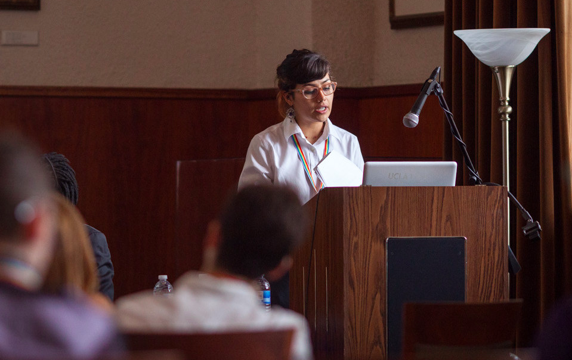

### WST 591: Reproductive Justice

::: {.grid}

::: {.g-col-12 .g-col-md-3}

:::

::: {.g-col-12 .g-col-md-9}

[Summer 2024]()

This graduate seminar is designed for students interested in learning theoretical and practical applications of Reproductive Justice. Coined by the U.S.-based, Black feminist collective SisterSong in 1994, Reproductive Justice (RJ) focuses not only on the right to have or not have children, but also the right to parent the children we have in safe and sustainable communities.

:::

:::

### SST 294: Introduction to LGBTQ History and Culture

::: {.grid}

::: {.g-col-12 .g-col-md-3}

:::

::: {.g-col-12 .g-col-md-9}

[Summer 2024]()

This undergraduate course offers a comprehensive overview of LGBTQ+ history and culture in the United States, tracing the evolution of their identities, movements, and cultural expressions from the early homophile movement in the 1950s through the institutionalization of the discipline in the 1990s. Students are introduced to formative cultural texts including the film, Paris is Burning (1990) and the semi-autobiographical novel, Stone Butch Blues (1993) by Leslie Feinberg.

:::

:::

