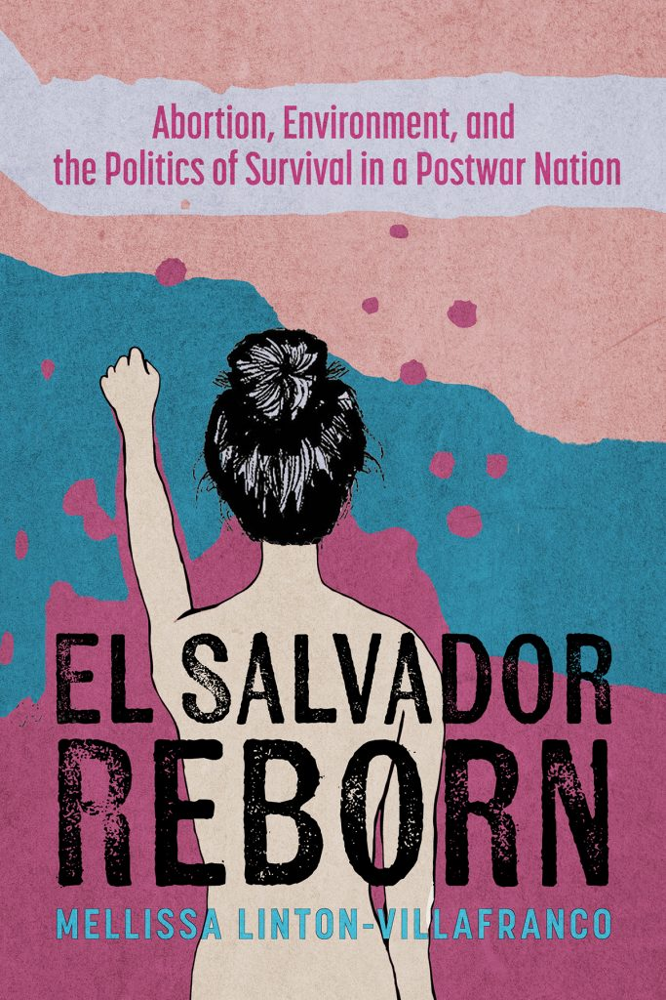
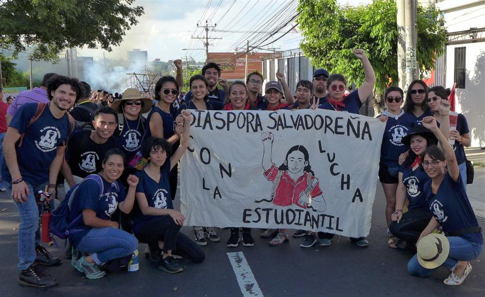

# Writing

Exploring reproductive justice, migration, environmental politics, social movements, and creative scholarship.

Book

## El Salvador Reborn: Abortion, Environment, and the Politics of Survival in a Postwar Nation

El Salvador Reborn analyzes the political shift under El Salvador's right-wing party after the civil war (1979–1992). Historically associated with death squads, the right repositioned itself as a pro-life force by criminalizing abortion, amending the constitution to declare that life begins at conception, and imposing penalties of up to thirty years. Salvadoran feminists responded through organizing, protest, and public art, demonstrating that reproductive justice and environmental justice are fundamentally intertwined.

Encyclopedia • 2025

## Central American Migrant Caravans

This peer-reviewed encyclopedia entry examines the emergence of migrant caravans from Honduras, El Salvador, and Guatemala. It explores the historical roots of migration, U.S. foreign policy, gender-based violence, and climate change while situating contemporary migration within broader regional political and environmental transformations.

Peer-Reviewed Journal Article

## Technologies of Care: Transborder Activism in the 2018 Central American Caravan

This article argues that Chicana and Salvadoran organizers developed "technologies of care" to sustain refugee arrivals in Tijuana. Through digital activism and embodied practices of solidarity, it demonstrates how activists mobilized across borders to support displaced communities.

Creative Writing

## Poetry and Creative Writing

This collection reflects on family history, migration, Salvadoran identity, memory, spirituality, and intergenerational storytelling through poetry and creative nonfiction, weaving together personal narratives with broader histories of displacement and belonging.

Ms. Magazine Op-Ed

## Resisting the Overturn of Roe: What U.S. Feminists Can Learn From El Salvador

Written following the overturning of *Roe v. Wade*, this essay examines how reproductive justice organizers in El Salvador resisted one of the world's strictest abortion bans and considers lessons for feminist movements in the United States.

Ms. Magazine Op-Ed

## Alabama's Fundamentalist Leap: Cells Are Not Human Beings

This commentary examines the Alabama Supreme Court's 2024 ruling recognizing frozen embryos as unborn children and situates the decision within broader campaigns advancing fetal personhood and Christian fundamentalist legal strategies.

Personal Essay

## A Personal Reflection on the Radical Roots Delegation

A reflective essay documenting participation in the 2018 Radical Roots delegation to El Salvador, exploring environmental justice, student activism, transnational solidarity, and the continuing struggle for water rights.

Audio Project

## Running With My Ancestors

An immersive audio narrative commemorating the July 30, 1975 Salvadoran National University Massacre. The project reflects on diaspora, collective memory, resistance, and the preservation of historical narratives through sound.

